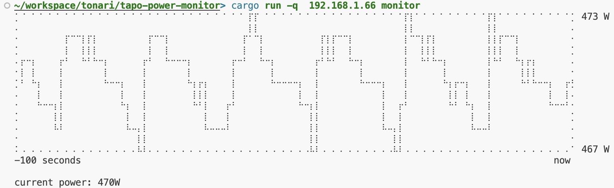
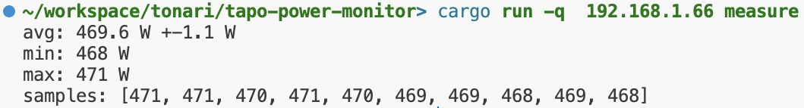

# Tonari Tapo Power Monitor

A utility to measure and monitor power consumption with Tp-Link Tapo smart plugs from your command line.

## Initial Setup

- We’re using the [TP-Link Tapo 115](https://www.tp-link.com/en/home-networking/smart-plug/tapo-p115/) smart plug. It can be controlled via TPLink cloud or via local network which is what this tool does.
- Download the TP-Link Tapo App from appstore of your choice. ([iOS, MacOS](https://itunes.apple.com/app/id1472718009) or [Android](https://play.google.com/store/apps/details?id=com.tplink.iot))
- Login to your TP-link account.
- Pair the plug with the account.
- Disable firmware auto-update in the device settings unless you're fine with your device to be spuriously power-cycled.

## Usage

- Set the `TAPO_USERNAME` and `TAPO_PASSWORD` environment to your Tapo account's username (i.e. email) and password respectively.
- Get the local IP of the device. Available in the device settings in the app or on your local router.
- Run `cargo run <IP> monitor` to continuously monitor immediate power consumption.
  
- run `cargo run <IP> measure` to take a single measurement (averaged over 10 samples).
  
